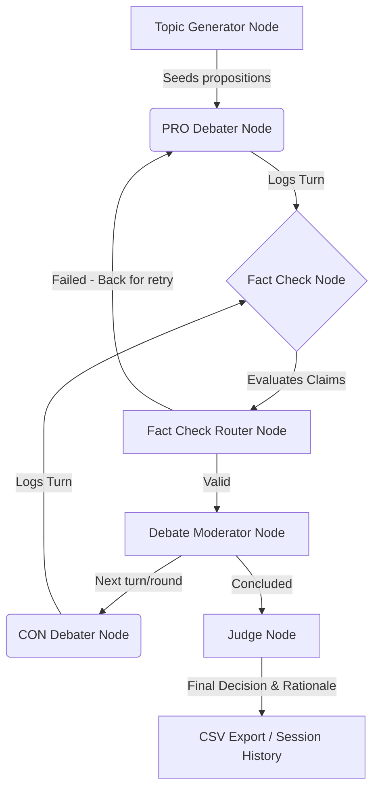

# Debate2.0 🎤🔥 - Advanced Multi-Agent AI Debate Platform

Welcome to **Debate2.0**, a premium web application that orchestrates advanced, multi-agent logic showdowns using a state-of-the-art **LangGraph** workflow. 

Put two AI agents head-to-head on any debate topic, supported by an automated real-time fact-checker that keeps arguments grounded in reality, and an impartial judge that issues the final verdict!

---

## ✦ System Overview & Architecture

Debate2.0 displays the true capability of structured multi-agent collaboration, utilizing a robust, cyclic state graph to manage round progression, fact-check disputes, and final judicial verdict evaluation.



### 🤖 Core Agents & Workflow Nodes
* **`GenerateTopicNode`**: Refines proposition inputs and establishes clear stances.
* **`ProDebaterNode` & `ConDebaterNode`**: Generate structured, persuasive arguments backing their respective positions using contextual memories of prior turns.
* **`FactCheckNode`**: Evaluates active debater claims for accuracy. If a hallucination or inaccuracy is flagged, the agent is issued an infraction and routed back to reconstruct their stance.
* **`DebateModeratorNode`**: Manages structural limits, rounds of debate, and automatically handles disqualification if an agent triggers excessive fact-check failures.
* **`JudgeNode`**: Impartially parses the debate, determining the winner and delivering a conversational, human-friendly summary verdict.

## ✦ AI Models & Orchestration Algorithms

### 🤖 LLM Deployment & Configuration
To maximize speed, accuracy, and rhetorical depth, Debate2.0 distributes orchestration tasks among distinct state-of-the-art LLMs via the **Groq Cloud API**:
* **Debater Agents (PRO and CON)**: Powered by `meta-llama/llama-4-scout-17b-16e-instruct` (a highly responsive model with complex contextual comprehension) to construct logical, structured, and rhetorically rich arguments.
* **Fact Checker Node**: Powered by `llama-3.1-8b-instant` (an extremely fast, low-latency model) to execute rapid, real-time assertions and claim cross-references.
* **Judge Node**: Powered by `meta-llama/llama-4-scout-17b-16e-instruct` to execute advanced logical reasoning and synthesize a neutral verdict.

### 🧠 Orchestration Algorithms
* **LangGraph Compiled State Machines:** Leverages compiled cyclic graphs (`StateGraph`) that maintain a persistent memory dictionary (`memory: {"PRO": [], "CON": []}`) containing historical contexts of previous turns, preserving topic consistency across rounds.
* **Dispute & Retry Routing Logic:** If a debater claim fails a fact-check, a conditional router redirects control flow back to the offending debater node, appending the fact-check feedback to the state and incrementing `retry_count` (bounded by a maximum `retry_limit` threshold) to force statement reconstruction.
* **Moderated Disqualification Safeguards:** An automated moderation algorithm monitors accumulated fact-check infractions. If either speaker's infractions exceed safety limits, the moderator halts the execution loop and issues an early automated disqualification.
* **Structured Output Validation:** Employs LangChain Structured Outputs bound to a strict Pydantic model (`DebateVerdict`) to validate LLM outputs, featuring exception-safe fallback handlers to prevent graph failure on unexpected JSON parsing issues.

---

## ✦ Premium Key Features

### 1. Isolated Session-bound History Tracking (`user_id`)
* **Session Persistence:** Generates a persistent unique `user_id` inside the browser's `localStorage`.
* **Personalized History:** Past debates lists are queried using standard `GET` requests bound to this session ID (`/debates?user_id=...`), showing users only their own historical session debates.
* **Backward-Compatible SQLite Migrations:** Seamlessly checks database tables at startup and automatically migrates the structure with an `ALTER TABLE debates ADD COLUMN user_id TEXT` action if not present.

### 2. Beautiful Judge Verdict Summaries
* **Conversational Judgments:** The Judge LLM prompt is engineered to output structured, conversational conclusions starting exactly like: `"Comparing the debate of both, we conclude that [the winner] is best because [reason]..."` rather than long dry technical breakdowns.
* **Prominent Real-Time UI Rationale Card:** When a debate concludes, a dedicated card pops up immediately under the Winner Banner displaying this human-friendly concluding justification.

### 3. High-Fidelity CSV Exports
* **Native Downloads:** The `/export` endpoint leverages FastAPI's `FileResponse` to initiate browser file downloads seamlessly.
* **Human-Readable Footer Summaries:** Exported CSVs are safe-encoded in `utf-8` and conclude with a beautiful, formatted **Debate Conclusion Summary** footer showing the decision results and the judge's full plain-English explanation.

### 4. Gorgeous Premium Styling
* Standardized navbar title branding **Debate2.0** mirroring the landing page typography, styling, and adding a sparkling star `✦` when dark mode is enabled.
* Highly polished, accessible royal purple (`#7c5cbf`) action button on the homepage with smooth hover indicators.

---

## 🛠️ Technology Stack

* **Backend:** FastAPI, LangGraph, Pydantic, LangChain Core, SQLite, Uvicorn
* **Frontend:** React (Vite), Vanilla CSS, SSE (Server-Sent Events) Stream Reader

---

## 🚀 Quick Start Guide

### 1. Setup Backend
Open your terminal in the root workspace directory:

```bash
# Install core dependencies
pip install -r requirements.txt

# Create your local environmental configuration (.env) from the template
cp .env.example .env
```

Configure the following keys in your newly created root `.env` file:
* **`GROQ_API_KEY`** (Required): Your Groq Cloud API Key to power the debaters and judge LLMs.
* **`OLLAMA_BASE_URL`** (Optional): Local model runner endpoint (e.g., `http://localhost:11434`).
* **`LANGCHAIN_API_KEY` / `LANGCHAIN_TRACING_V2` / `LANGCHAIN_PROJECT`** (Optional): Enable LangSmith tracing by providing your LangChain keys to debug the LangGraph workflows in real time.

```bash
# Run the FastAPI server
uvicorn api.main:app --reload --port 8000
```
The API backend will start running live at `http://localhost:8000`.

### 2. Setup Frontend
Navigate to the `frontend` folder:

```bash
cd frontend

# Install package dependencies
npm install

# Create your local frontend configuration (.env) from the template
cp .env.example .env
```

Configure the following key inside `frontend/.env`:
* **`VITE_API_URL`**: Set to the URL of the running API server (defaults to `http://localhost:8000`).

```bash
# Run the development server
npm run dev
```
Open `http://localhost:5173` in your browser to experience **Debate2.0**!

---

## 🧪 Running Unit Tests
A comprehensive test suite is available under `/tests` to verify workflow routers, retry limits, LLM output structures, and parsing fallbacks.

```bash
# Execute unit tests
pytest
```
